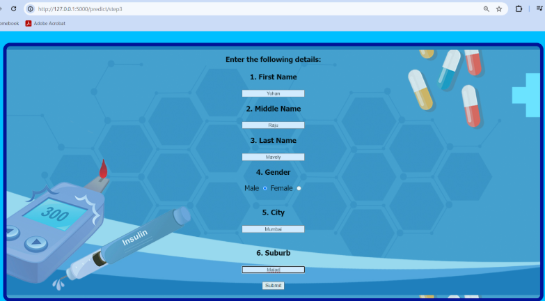

# 🏥 AI-Diagnosis-and-Doctor-Recommendation-System
 An ML system for predicting and diagnosing diabetes and recommending doctors based on the diagnosis.

# 📌 Overview
This project aims to provide an AI-based health diagnosis system for diabetes detection and doctor recommendations. Using machine learning models, it predicts the likelihood of a patient having diabetes and suggests specialized doctors for further consultation.

# 🚀 Features
✅ Diabetes Prediction: Uses a trained machine learning model to predict diabetes risk.

✅ Doctor Recommendation: Suggests nearby doctors specializing in diabetes management.

✅ User-Friendly Interface: A simple web-based frontend for ease of use.

✅ Data-Driven Insights: Predicts based on medical parameters like glucose levels, BMI, age, etc.

# 🛠️ Tech Stack
Machine Learning: Scikit-learn (Logistic Regression, Decision Trees, etc.)

Backend: Flask (Python)

Frontend: HTML, CSS, JavaScript

Database: SQLite (for storing doctor recommendations)

# 📊 Dataset Used
The PIMA Indians Diabetes Dataset from Kaggle was used for training the diabetes prediction model.

# 📜 Installation
1. Clone the repository
   ```bash
   git clone https://github.com/your-username/AI-Diagnosis-and-Doctor-Recommendation-System.git
   cd AI-Diagnosis-and-Doctor-Recommendation-System

2. Install dependencies
   ```bash
   pip install -r requirements.txt

3. Run the Flask app
   ```bash
   python app.py

4. Access the web app at
   ```bash
   http://localhost:5000

# 🖼️ Screenshots
a. Home Page


b. Prediction Page (Step 1)


c. Prediction Page (Step 2)


d. Prediction Page (Step 3)



e. Prediction Page (Final Report)


f. Recommended Doctors


# 📌 Future Scope
Extend diagnosis to heart disease prediction (which is done in the final year project).

Enhance the ML model with deep learning approaches.

Integrate real-time doctor availability.


## 👩‍💻 Contributors/Collaborators  
- [Saileen Fernandes (@Sai25Hajime)](https://github.com/Sai25Hajime)
- [Yohan Mavely (@BlueLightningWizard)](https://github.com/BlueLightningWizard) 
- [Nadeem Mithawala (@Nadeem-Mithawala)](https://github.com/Nadeem-Mithawala).

